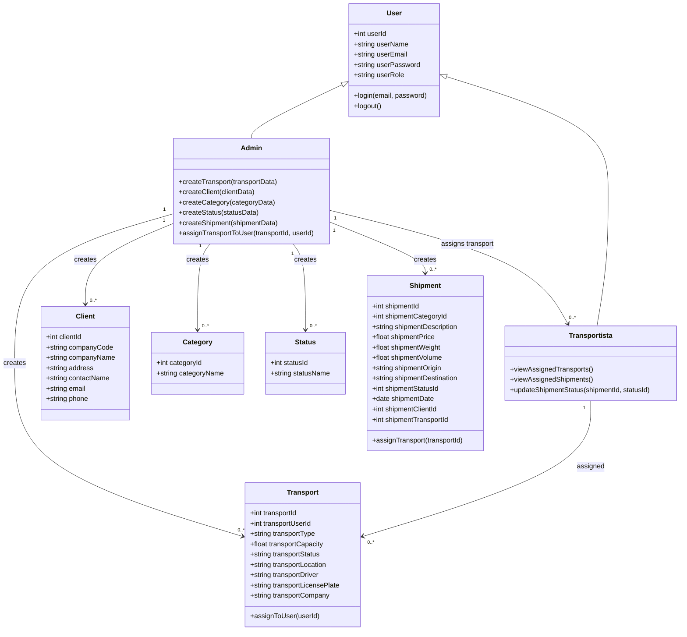
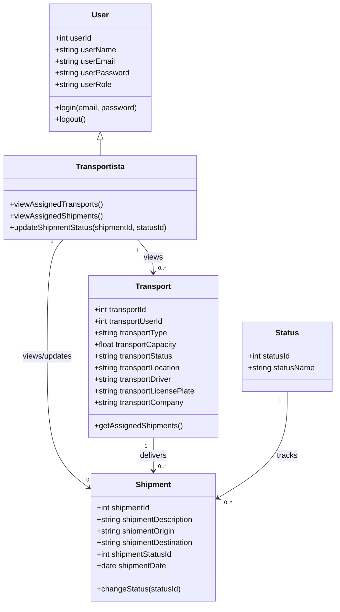

# Diagrama de Clases: Sistema de Envios

## Vista Admin

```mermaid
classDiagram
  class User {
    +int userId
    +string userName
    +string userEmail
    +string userPassword
    +string userRole
    +login(email, password)
    +logout()
  }

  class Admin {
    +createTransport(transportData)
    +createClient(clientData)
    +createCategory(categoryData)
    +createStatus(statusData)
    +createShipment(shipmentData)
    +assignTransportToUser(transportId, userId)
  }

  class Transportista {
    +viewAssignedTransports()
    +viewAssignedShipments()
    +updateShipmentStatus(shipmentId, statusId)
  }

  class Transport {
    +int transportId
    +int transportUserId
    +string transportType
    +float transportCapacity
    +string transportStatus
    +string transportLocation
    +string transportDriver
    +string transportLicensePlate
    +string transportCompany
    +assignToUser(userId)
  }

  class Client {
    +int clientId
    +string companyCode
    +string companyName
    +string address
    +string contactName
    +string email
    +string phone
  }

  class Category {
    +int categoryId
    +string categoryName
  }

  class Status {
    +int statusId
    +string statusName
  }

  class Shipment {
    +int shipmentId
    +int shipmentCategoryId
    +string shipmentDescription
    +float shipmentPrice
    +float shipmentWeight
    +float shipmentVolume
    +string shipmentOrigin
    +string shipmentDestination
    +int shipmentStatusId
    +date shipmentDate
    +int shipmentClientId
    +int shipmentTransportId
    +assignTransport(transportId)
  }

  User <|-- Admin
  User <|-- Transportista
  Admin "1" --> "0..*" Transport : creates
  Admin "1" --> "0..*" Client : creates
  Admin "1" --> "0..*" Category : creates
  Admin "1" --> "0..*" Status : creates
  Admin "1" --> "0..*" Shipment : creates
  Admin "1" --> "0..*" Transportista : assigns transport
  Transportista "1" --> "0..*" Transport : assigned
```

## Vista Transportista

```mermaid
classDiagram
  class User {
    +int userId
    +string userName
    +string userEmail
    +string userPassword
    +string userRole
    +login(email, password)
    +logout()
  }

  class Transportista {
    +viewAssignedTransports()
    +viewAssignedShipments()
    +updateShipmentStatus(shipmentId, statusId)
  }

  class Transport {
    +int transportId
    +int transportUserId
    +string transportType
    +float transportCapacity
    +string transportStatus
    +string transportLocation
    +string transportDriver
    +string transportLicensePlate
    +string transportCompany
    +getAssignedShipments()
  }

  class Shipment {
    +int shipmentId
    +string shipmentDescription
    +string shipmentOrigin
    +string shipmentDestination
    +int shipmentStatusId
    +date shipmentDate
    +changeStatus(statusId)
  }

  class Status {
    +int statusId
    +string statusName
  }

  User <|-- Transportista
  Transportista "1" --> "0..*" Transport : views
  Transportista "1" --> "0..*" Shipment : views/updates
  Transport "1" --> "0..*" Shipment : delivers
  Status "1" --> "0..*" Shipment : tracks
```
