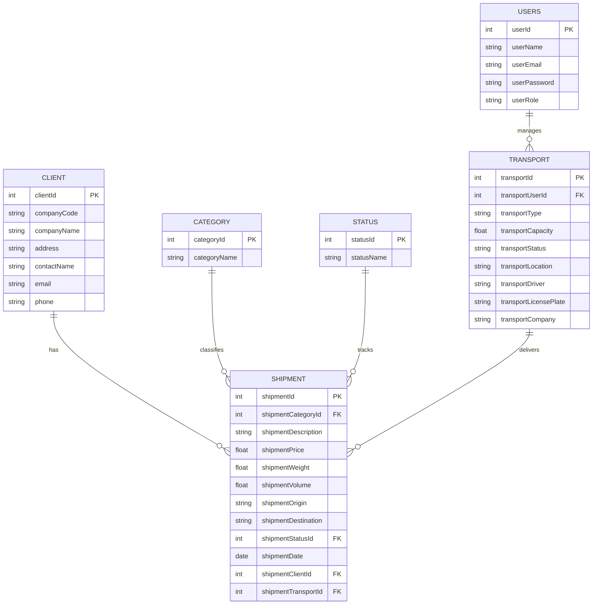

# Diagrama Entidad-Relacion: Sistema de Envios

```mermaid
erDiagram
  USERS ||--o{ TRANSPORT : manages
  CLIENT ||--o{ SHIPMENT : has
  CATEGORY ||--o{ SHIPMENT : classifies
  STATUS ||--o{ SHIPMENT : tracks
  TRANSPORT ||--o{ SHIPMENT : delivers

  USERS {
    int userId PK
    string userName
    string userEmail
    string userPassword
    string userRole
  }

  TRANSPORT {
    int transportId PK
    int transportUserId FK
    string transportType
    float transportCapacity
    string transportStatus
    string transportLocation
    string transportDriver
    string transportLicensePlate
    string transportCompany
  }

  CLIENT {
    int clientId PK
    string companyCode
    string companyName
    string address
    string contactName
    string email
    string phone
  }

  CATEGORY {
    int categoryId PK
    string categoryName
  }

  STATUS {
    int statusId PK
    string statusName
  }

  SHIPMENT {
    int shipmentId PK
    int shipmentCategoryId FK
    string shipmentDescription
    float shipmentPrice
    float shipmentWeight
    float shipmentVolume
    string shipmentOrigin
    string shipmentDestination
    int shipmentStatusId FK
    date shipmentDate
    int shipmentClientId FK
    int shipmentTransportId FK
  }
```
